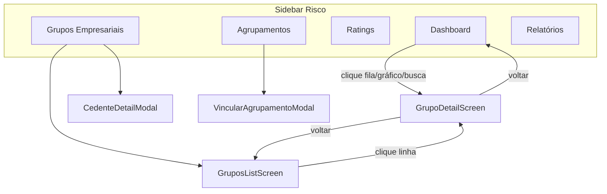

# Handoff — Módulo de Risco

> Fonte de verdade complementar: `guidelines/Guidelines.md` (design tokens e padrão estrutural de telas de detalhe). Este documento cobre **todo o módulo** em `src/features/risco/` — navegação, dados mockados, telas, modais e convenções de UI.

---

## 1. Onde fica e como o módulo é montado

### Entrada no app

O módulo é registrado em `src/features/risco/index.ts` e montado em `ModulesScreen.vue` via query `?view=`:

| View (`?view=`) | Tela | Componente |
|---|---|---|
| `risco-dashboard` | Dashboard | `RiscoDashboardScreen.vue` |
| `risco-grupos` | Grupos Empresariais | `GruposScreen.vue` |
| `risco-ratings` | Cadastro de Rating | `RatingsScreen.vue` |
| `risco-agrupamentos` | Agrupamentos de Limite | `AgrupamentosScreen.vue` |
| `risco-rel` | Relatórios | `RelatoriosScreen.vue` |

O menu lateral (`Sidebar.vue`) agrupa tudo sob **Risco** com os mesmos 5 itens.

### Árvore de pastas

```
src/features/risco/
├── index.ts                          → exports das 5 telas
├── data/
│   └── riscoData.ts                  → tipos, seeds, helpers, detalheGrupo()
├── screens/
│   ├── RiscoDashboardScreen.vue      → dashboard + drill-down para grupo
│   ├── GruposScreen.vue              → roteador list → detail
│   ├── GruposListScreen.vue          → listagem com filtros/paginação
│   ├── GrupoDetailScreen.vue         → detalhe do grupo (4 abas)
│   ├── RatingsScreen.vue
│   ├── AgrupamentosScreen.vue
│   ├── RelatoriosScreen.vue
│   └── detail-tabs/
│       ├── DetalhesTab.vue
│       ├── ParametrizacoesTab.vue    → sub-abas underline
│       ├── LimiteSubTab.vue
│       ├── AutoatendimentoSubTab.vue
│       ├── GeralSubTab.vue
│       ├── GarantiaSubTab.vue
│       ├── CedentesTab.vue
│       ├── HistoricoTab.vue
│       └── shared/                   → TabPill, TabCard, FormField, ToggleRow...
└── components/modals/
    ├── CedenteDetailModal.vue
    ├── VincularAgrupamentoModal.vue
    ├── CreateRatingModal.vue
    ├── CreateAgrupamentoModal.vue
    └── ... (10 modais no total)
```

---

## 2. De onde vêm os dados

Hoje **tudo é mock** em `src/features/risco/data/riscoData.ts`. A estrutura já separa o que viria da API de listagem vs. detalhe.

### a) Seeds globais (cadastros independentes)

| Seed | Interface | Uso |
|---|---|---|
| `RATINGS_SEED` | `Rating` | Tela Ratings + select de rating em Detalhes/Parametrizações |
| `AGRUPAMENTOS_SEED` | `Agrupamento` | Tela Agrupamentos de Limite |
| `OPERACOES_VINCULAVEIS_SEED` | `OperacaoVinculavel` | Modal Vincular Agrupamento (CRAs/FIDCs) |
| `GERENTES_SEED` | `Gerente` | Filtros, transferência de gerente, card de gerente |
| `GRUPOS_SEED` | `GrupoEmpresarial` | Dashboard, listagem, relatórios, detalhe |

### b) `GrupoEmpresarial` — dados da listagem

Campos principais do card/linha:

```ts
interface GrupoEmpresarial {
  id: string;
  documento: string;
  nome: string;
  tipoCliente: 'Monocedente' | 'Multicedente';
  statusOperacao: StatusOperacao;   // Normal, Terceiro, Pré-Recovery, Recovery, Especial, Special-Sit
  limite: number;
  limiteAutoatendimento: number;
  riscoTotal: number;
  riscoUraStt: number;
  gerente: string;
  vencimentoLimite: string | null;
  vencimentoParecer: string | null;
  parecerCredito: ParecerStatus;    // CONFORME | EXPIRANDO | EXPIRADO | AUSENTE
  rating: string;
  valorVencido: number;
}
```

Chega via prop `:grupo` quando o usuário abre um grupo (dashboard, listagem ou busca).

### c) `DetalheGrupo` — dados ricos do detalhe

Partes relacionadas, parametrizações, cedentes e histórico **não existem** em `GrupoEmpresarial`. São derivados na hora:

```ts
// GrupoDetailScreen.vue
const det = reactive(detalheGrupo(props.grupo));
```

```ts
// riscoData.ts
export function detalheGrupo(grupo: GrupoEmpresarial): DetalheGrupo {
  return {
    partesRelacionadas: buildPartesRelacionadas(grupo),
    parametrizacoes: { limite, autoatendimento, geral, garantia },
    cedentes: [ /* 2 cedentes mock por grupo */ ],
    historico: [ /* 3 eventos */ ],
  };
}
```

`det` é reativo e mutado localmente nas abas (salvar parametrização, editar cedente, etc.).

> **Quando a API real existir:** `detalheGrupo(grupo)` vira `GET /grupos/{id}/detalhe`. As abas já consomem `det` via props — a árvore de componentes não precisa mudar.

### d) Estado local nas telas de cadastro

| Tela | Estado local | Seed inicial |
|---|---|---|
| `RatingsScreen` | `ratings = ref(RATINGS_SEED)` | CRUD em memória |
| `AgrupamentosScreen` | `agrupamentos` + `operacoes` | `AGRUPAMENTOS_SEED` + `OPERACOES_VINCULAVEIS_SEED` |
| `GruposListScreen` | `grupos = ref(GRUPOS_SEED)` | Filtros/paginação em cima do ref |
| `RelatoriosScreen` | filtros + `applied` | Consulta `GRUPOS_SEED` filtrado |

### e) Helpers de negócio (já prontos para reutilizar)

| Função | O que faz |
|---|---|
| `brl(n, { compact? })` | Formata moeda (compact: `R$ 2,1M`, `R$ 450K`) |
| `fmtPct(n)` | Percentual pt-BR (`1,45%`) |
| `statusOperacaoColor(s)` | Cor do badge de status de operação |
| `parecerLabel(s)` / `parecerColor(s)` | Label e cor do parecer de crédito |
| `isLimiteVencido(vencimento)` | Limite já passou da data |
| `isProximoAVencer(vencimento, dias=30)` | Vence nos próximos N dias |
| `temRiscoAtivo(g)` | `g.riscoTotal > 0` |
| `diasEntre(dataBR)` | Dias entre data dd/mm/aaaa e hoje |
| `statusGrupoPizza(s)` | Agrupa status para gráfico pizza do dashboard |
| `contarVinculos(agrupamentoId, operacoes)` | Conta CRAs/FIDCs vinculados |
| `nomesAgrupamentos(op, agrupamentos)` | Nomes dos agrupamentos de uma operação |
| `gerentePorNome(nome)` | Busca gerente em `GERENTES_SEED` |

### Regra prática para achar um campo

1. Prop `grupo` (`GrupoEmpresarial`) — header, KPIs, colunas da listagem;
2. Prop `det` (`DetalheGrupo`, de `detalheGrupo()`) — abas Detalhes, Parametrizações, Cedentes, Histórico;
3. Seeds globais (`RATINGS_SEED`, `AGRUPAMENTOS_SEED`, etc.) — cadastros e selects;
4. Estado local `ref`/`reactive` na tela — alterações do usuário ainda não persistidas.

---

## 3. Fluxos de navegação



### Dashboard (`RiscoDashboardScreen.vue`)

- KPIs calculados de `GRUPOS_SEED` (valores vencidos, exposição total, limites vencidos/a vencer, etc.).
- Duas filas clicáveis: **Risco ativo c/ limite vencido** e **Risco ativo c/ limite próximo a vencer**.
- 3 gráficos (Chart.js via `vue-chartjs`): Limite por Rating, Risco por Rating, Risco por Status (pizza).
- Busca no header → dropdown de resultados → abre `GrupoDetailScreen` inline (`route = { level: 'detail', grupoId }`).

### Grupos Empresariais (`GruposScreen` → `GruposListScreen`)

Listagem completa com:
- Busca por nome, filtros avançados (gerente, tipo cliente, parecer, vencimento), quick filters de parecer (Vencido / Próximo a Vencer / Em Dia);
- Colunas configuráveis (menu com `Checkbox` padrão `@/components/ui/Checkbox.vue`);
- Paginação (10/25/50 por página);
- Menu ⋮ por linha: Transferir gerente, Configurar notificações, Habilitar para operar;
- Clique na linha → `GrupoDetailScreen`.

### Detalhe do Grupo (`GrupoDetailScreen.vue`)

Header padrão (voltar 48×48, eyebrow "Risco · Grupo Empresarial", badge de status, menu ⋮) + **4 abas TabPill**:

| Aba | Componente | Conteúdo |
|---|---|---|
| Detalhes | `DetalhesTab.vue` | Partes relacionadas, Parecer de Crédito, Rating, Gerente, Limites por produto |
| Parametrizações | `ParametrizacoesTab.vue` | Sub-abas underline: Limite · Autoatendimento · Geral · Garantia |
| Cedentes | `CedentesTab.vue` | Tabela paginada → `CedenteDetailModal` |
| Histórico | `HistoricoTab.vue` | Timeline de eventos |

**Padrão de sub-abas underline (Parametrizações):** as sub-abas ficam **fora** do card branco; cada `*SubTab` renderiza `TabCard`(s) com formulário e botão Salvar. Referência visual: `ParametrizacoesTab.vue` + `LimiteSubTab.vue`.

### Ratings (`RatingsScreen.vue`)

CRUD simples em memória: tabela Nome / Taxa / Criado em + `CreateRatingModal` (criar/editar).

### Agrupamentos de Limite (`AgrupamentosScreen.vue`)

Tabela com contagem de CRAs/FIDCs vinculados. Ações:
- **Novo agrupamento** → `CreateAgrupamentoModal`;
- **Renomear** → mesmo modal com `initial`;
- **Excluir** → `DeleteAgrupamentoModal`;
- **Clique na linha** → `VincularAgrupamentoModal` (painel duplo de transferência CRA/FIDC).

### Relatórios (`RelatoriosScreen.vue`)

Catálogo de relatórios (hoje só **Parecer de Crédito**). Fluxo: selecionar → filtros (nome, status grupo, gerente, status parecer) → Gerar → tabela + exportar CSV (mock, gera blob no browser).

---

## 4. Parametrizações — estrutura de dados

`DetalheGrupo.parametrizacoes` é um objeto com 4 blocos:

```ts
interface Parametrizacoes {
  limite: ParametrizacaoLimite;           // parecer, rating, tabela de limites por produto
  autoatendimento: ParametrizacaoAutoatendimento;
  geral: ParametrizacaoGeral;             // confirmações, Serasa, laudos, avalistas, exceções
  garantia: ParametrizacaoGarantia;
}
```

| Sub-aba | Arquivo | Destaques |
|---|---|---|
| Limite | `LimiteSubTab.vue` | Upload parecer, rating, tabela agrupamento×produto, `IncluirLimiteModal` |
| Autoatendimento | `AutoatendimentoSubTab.vue` | Limite auto, taxas fee/risco/cessão, veículo preferencial |
| Geral | `GeralSubTab.vue` | Percentuais, toggles (`ToggleRow`), exceções de concentração, avalistas obrigatórios |
| Garantia | `GarantiaSubTab.vue` | Confirmação de títulos, % garantia, tabela de tipos de garantia |

Salvar em cada sub-aba emite `@save` → `ParametrizacoesTab` propaga `@change` → `GrupoDetailScreen` atualiza `det.parametrizacoes`.

---

## 5. Cedente — modal de detalhe

`CedenteDetailModal.vue` abre ao clicar numa linha em `CedentesTab`:

- Header com KPIs (`KpiCard`: títulos em aberto, risco tomado, data abertura);
- Abas TabPill: **Contatos** · **Endereços** · **Documentos**;
- Painéis em `components/modals/cedente-detail/` (`ContatosPanel`, `EnderecosPanel`, `DocumentosPanel`);
- Botão editar → `EditarCadastroCedenteModal` (formulário PF/PJ completo);
- Emite `@update` → `CedentesTab` → `GrupoDetailScreen` substitui o cedente no array `det.cedentes`.

---

## 6. Modais do módulo

| Modal | Disparado de | Função |
|---|---|---|
| `CreateRatingModal` | Ratings | Criar/editar rating (nome + taxa) |
| `CreateAgrupamentoModal` | Agrupamentos | Criar/renomear agrupamento |
| `DeleteAgrupamentoModal` | Agrupamentos | Confirmar exclusão |
| `VincularAgrupamentoModal` | Agrupamentos (clique linha) | Vincular/desvincular CRAs e FIDCs |
| `TransferirGerenteModal` | Grupo detail / listagem | Trocar gerente (mock) |
| `ConfigurarNotificacoesModal` | Grupo detail / listagem | Configurar alertas (mock) |
| `HabilitarOperarModal` | Grupo detail / listagem | Habilitar grupo (mock) |
| `CedenteDetailModal` | Cedentes tab | Ver/editar cedente |
| `EditarCadastroCedenteModal` | Cedente detail | Formulário de cadastro |
| `IncluirLimiteModal` | Limite sub-tab | Adicionar linha de limite por produto |

`VincularAgrupamentoModal` usa subcomponentes em `components/modals/vincular-agrupamento/` (`TransferPanel`, `OperationRow`, `SummaryCard`, `TransferButton`). Seleção de operações via `Checkbox` padrão (`@/components/ui/Checkbox.vue`).

---

## 7. Componentes compartilhados (`screens/detail-tabs/shared/`)

Reaproveitar em novas telas do módulo — **não** repetir estilos inline de label/campo:

| Componente | Papel |
|---|---|
| `TabPill.vue` | Abas externas (Detalhes / Parametrizações / Cedentes / Histórico) |
| `TabCard.vue` | Card branco com ícone, título, slot de conteúdo e botão Salvar opcional (`has-save`) |
| `Section.vue` | Título uppercase laranja + conteúdo (usado em Relatórios) |
| `FieldLabel.vue` | Label de formulário com estado de erro |
| `FormField.vue` | Input texto com label |
| `SelectField.vue` | Select com label |
| `PctInput.vue` | Input percentual |
| `DiasInput.vue` | Input numérico de dias |
| `ToggleRow.vue` | Toggle Sim/Não (usado extensivamente em Geral/Garantia) |
| `EmptyState.vue` | Placeholder tracejado |
| `AddButton.vue` | Botão "+" para adicionar linha em formulários |

### Checkbox padrão do sistema

Seleções (colunas visíveis, vincular agrupamento, avalistas) usam `src/components/ui/Checkbox.vue` — props `checked`, `indeterminate?`, `disabled?`, emite `change`.

---

## 8. Tipografia e espaçamento

Mesmos tokens de `src/styles/theme.css` e `guidelines/Guidelines.md`.

| Contexto | Valor típico |
|---|---|
| Título de página (Dashboard, Ratings, etc.) | `26px`, `font-weight: bold` |
| Título de detalhe (grupo) | `--text-xl` (20px) |
| Eyebrow "Risco · ..." | `10px` ou `11px`, `letter-spacing: 0.18em`, uppercase, `--accent` |
| Corpo / células de tabela | `--text-sm` (13px) |
| Cabeçalho de tabela | `10px`, uppercase, `letter-spacing: 0.08–0.12em` |
| Gap entre blocos principais | `24px` |
| Gap entre cards no detalhe | `20px` |
| Padding de linha de tabela | `12–14px 16–20px` |
| Botão primário "Novo rating/agrupamento" | `height: 48px`, `--agro-base`, sombra laranja |

Números monetários e datas: sempre `font-variant-numeric: tabular-nums`.

Badges de status usam `color-mix(in srgb, ${cor} 14%, transparent)` no fundo + cor semântica no texto (padrão do header de grupo).

---

## 9. Gráficos (Dashboard)

- Biblioteca: `vue-chartjs` + `chart.js` (registrado em `@/lib/chart`).
- Cores hardcoded nos datasets (paleta GCI laranja/teal para barras; verde/laranja/cinza/teal para pizza) — **não** vêm de tokens CSS hoje.
- Tooltips formatam valores com `brl(..., { compact: true })`.

---

## 10. O que ainda é mock / fora de escopo

- Nenhuma chamada HTTP — CRUD, filtros, export CSV e modais só alteram estado local;
- Upload de parecer/documentos é visual (botões Eye/RefreshCw sem backend);
- Vinculação CRA/FIDC não persiste entre sessões;
- Relatórios: apenas "Parecer de Crédito"; export é CSV gerado no browser;
- Dashboard e listagem compartilham `GRUPOS_SEED` estático (8 grupos).

---

## 11. Checklist para evoluir o módulo

1. **Tipos primeiro** — consultar `riscoData.ts` antes de criar campos novos; estender interfaces e seeds juntos.
2. **Listagem vs. detalhe** — campos do card vão em `GrupoEmpresarial`; o resto em `DetalheGrupo` via `detalheGrupo()`.
3. **Sub-abas underline** — tabs fora do card; conteúdo dentro de `TabCard`. Não colocar a barra de sub-abas dentro do container branco.
4. **Reutilizar `shared/`** — `TabCard`, `FormField`, `ToggleRow`, `Checkbox` padrão.
5. **Cores de status** — usar `statusOperacaoColor`, `parecerColor`, `statusCedenteColor` em vez de hex solto.
6. **API futura** — substituir seeds por fetch; manter props `grupo` + `det` nas abas.

---

## 12. Referências rápidas de arquivos

| Arquivo | Conteúdo |
|---|---|
| `src/features/risco/data/riscoData.ts` | Tipos, seeds, `detalheGrupo()`, helpers |
| `src/features/risco/screens/RiscoDashboardScreen.vue` | Dashboard com KPIs, filas, gráficos |
| `src/features/risco/screens/GruposScreen.vue` | Roteador list ↔ detail |
| `src/features/risco/screens/GruposListScreen.vue` | Listagem com filtros, colunas, paginação |
| `src/features/risco/screens/GrupoDetailScreen.vue` | Detalhe do grupo (4 abas + modais de ação) |
| `src/features/risco/screens/detail-tabs/ParametrizacoesTab.vue` | Sub-abas underline de parametrização |
| `src/features/risco/screens/detail-tabs/shared/` | Design system local do módulo |
| `src/features/risco/components/modals/` | Todos os modais |
| `src/components/ui/Checkbox.vue` | Checkbox padrão do sistema |
| `src/components/layout/Sidebar.vue` | Menu Risco (5 itens) |
| `src/app/ModulesScreen.vue` | Montagem das views `risco-*` |
| `src/styles/theme.css` | Tokens de design |
| `guidelines/Guidelines.md` | Padrão estrutural de telas de detalhe |
